<p align="center"></p>

<p align="center"><sub>10-second tour: Upload → Detect → Embed → Store → Retrieve → Answer</sub></p>

<p align="center">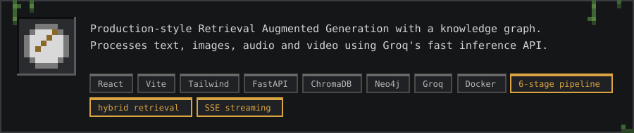</p>

<p align="center"></p>

<a id="architecture"></a>
<h2></h2>

<p align="center"></p>

```
User → React Frontend → FastAPI Backend
                              │
              ┌───────────────┼───────────────┐
              ▼               ▼               ▼
         ChromaDB          Neo4j          Groq API
       (vector store)   (graph store)  (LLM + Whisper)
              │               │
              └───────────────┘
                  Hybrid Retrieval
                       │
                   LLM Response
```

<a id="tech-stack"></a>
<h2>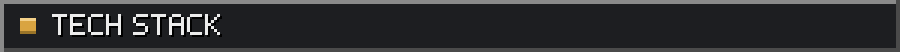</h2>

<p align="center">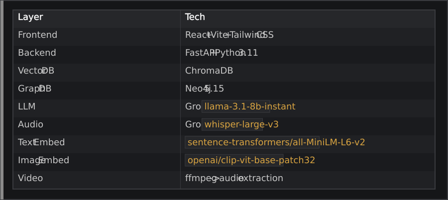</p>

<a id="pipeline"></a>
<h2>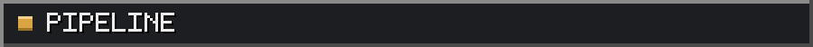</h2>

<p align="center"></p>

<a id="quick-start"></a>
<h2></h2>

<a id="prerequisites"></a>
<h3>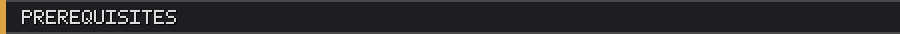</h3>

<p align="center">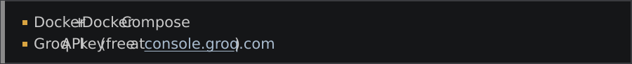</p>

<p align="center"><a href="https://console.groq.com">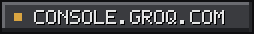</a></p>

<a id="setup"></a>
<h3>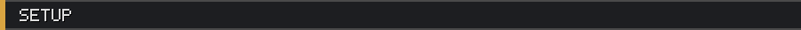</h3>

<p align="center"></p>

```bash
# Clone and enter project
git clone https://github.com/thanmaiashok/multimodal-graph-rag--datamesh.git
cd multimodal-graph-rag--datamesh

# Copy env and add your Groq key
cp .env.example .env
# Edit .env: set GROQ_API_KEY=gsk_...

# Build and start all services
docker compose up --build

# Services start order: chromadb → neo4j → backend → frontend
# Wait ~2 minutes for first build (downloads ML models)
```

<a id="access"></a>
<h3>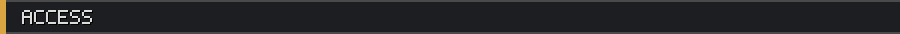</h3>

<p align="center">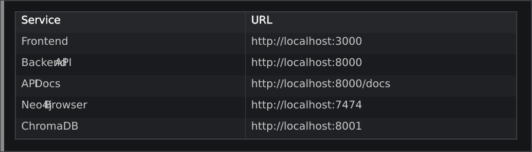</p>

<a id="api-reference"></a>
<h2></h2>

<a id="post-apiupload"></a>
<h3>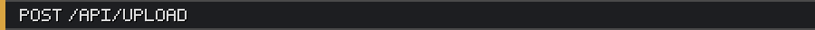</h3>

<p align="center">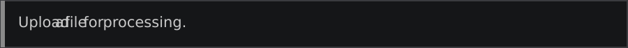</p>

<p align="center"></p>

```bash
curl -X POST http://localhost:8000/api/upload \
  -F "file=@document.pdf"
```

<p align="center">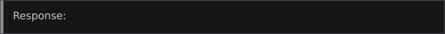</p>

<p align="center"></p>

```json
{
  "file_id": "uuid",
  "filename": "document.pdf",
  "modality": "text",
  "status": "processed",
  "entities_extracted": 12,
  "chunks_indexed": 34
}
```

<a id="post-apichat"></a>
<h3>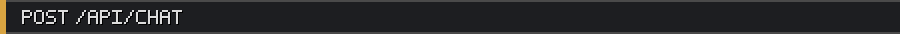</h3>

<p align="center">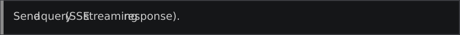</p>

<p align="center"></p>

```bash
curl -X POST http://localhost:8000/api/chat \
  -H "Content-Type: application/json" \
  -d '{"message": "What are the key concepts?", "modality": "text", "history": []}'
```

<a id="get-apigraph"></a>
<h3>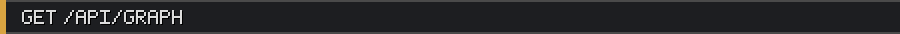</h3>

<p align="center">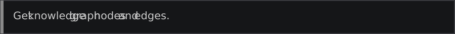</p>

<p align="center"></p>

```bash
curl http://localhost:8000/api/graph
```

<a id="local-development-without-docker"></a>
<h2>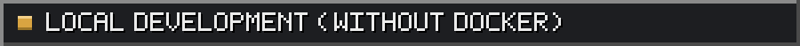</h2>

<p align="center"></p>

```bash
# Backend
cd backend
python -m venv venv && source venv/bin/activate
pip install -r requirements.txt
# Start ChromaDB and Neo4j separately, then:
uvicorn main:app --reload

# Frontend
cd frontend
npm install
npm run dev
```

<a id="environment-variables"></a>
<h2></h2>

<p align="center">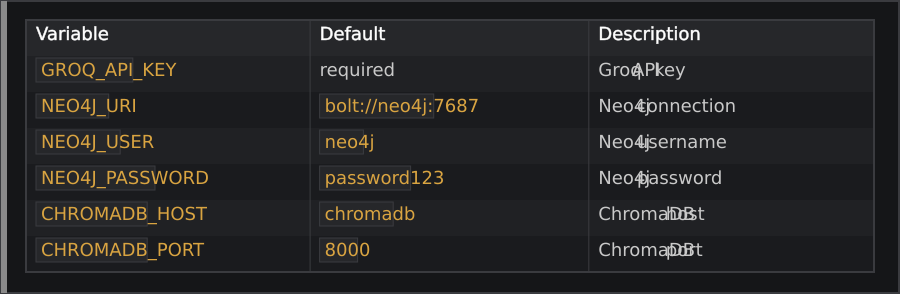</p>

<a id="features"></a>
<h2></h2>

<p align="center">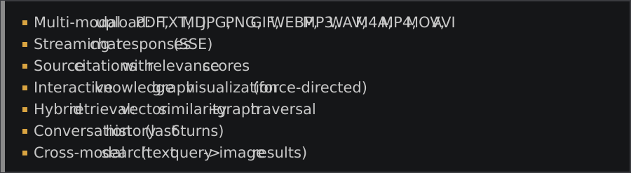</p>

<p align="center"><a href="https://github.com/thanmaiashok"></a></p>
